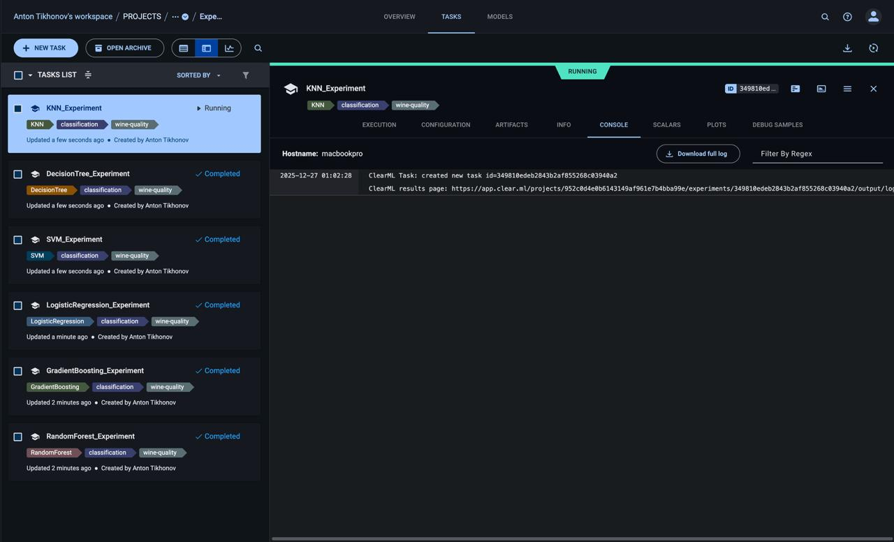

# EPML ITMO Project - Wine Quality Classification

Data Science Project for EPML ITMO with MLOps integration using ClearML.

---

## 📋 Домашнее задание 5: ClearML для MLOps

### Содержание
- [Описание проекта](#описание-проекта)
- [Настройка ClearML](#1-настройка-clearml-3-балла)
- [Трекинг экспериментов](#2-трекинг-экспериментов-3-балла)
- [Управление моделями](#3-управление-моделями-3-балла)
- [Пайплайны](#4-пайплайны-2-балла)
- [Быстрый старт](#быстрый-старт)
- [Структура проекта](#структура-проекта)

---

## Описание проекта

Проект демонстрирует полную интеграцию ClearML для MLOps workflow на примере задачи классификации качества вина. Реализованы:
- Автоматический трекинг экспериментов
- Версионирование моделей
- ML пайплайны
- Дашборды и сравнение экспериментов

### Используемые модели
- Random Forest
- Gradient Boosting
- Logistic Regression
- SVM
- Decision Tree
- KNN

---

## 1. Настройка ClearML (3 балла)

### 1.1 Установка ClearML Server через Docker

Проект включает готовый `docker-compose.yml` для развертывания ClearML Server:

```bash
# Запуск ClearML Server
make clearml_server_start

# Или напрямую
cd clearml && docker-compose up -d
```

**Компоненты:**
- **MongoDB** - основная база данных
- **Elasticsearch** - поиск и аналитика
- **Redis** - кэширование и сессии
- **ClearML API Server** - REST API (порт 8008)
- **ClearML Web Server** - веб-интерфейс (порт 8080)
- **ClearML File Server** - хранилище файлов (порт 8081)
- **ClearML Agent** - опционально для удаленного выполнения

**Доступ к сервисам:**
- Web UI: http://localhost:8080
- API: http://localhost:8008
- Files: http://localhost:8081

### 1.2 Настройка аутентификации

1. Откройте Web UI: http://localhost:8080
2. Перейдите в Settings → Workspace → Create new credentials
3. Скопируйте credentials

**Способы настройки:**

**Вариант 1: Интерактивная настройка**
```bash
clearml-init
```

**Вариант 2: Переменные окружения**
```bash
export CLEARML_API_HOST=http://localhost:8008
export CLEARML_WEB_HOST=http://localhost:8080
export CLEARML_FILES_HOST=http://localhost:8081
export CLEARML_API_ACCESS_KEY=<your_access_key>
export CLEARML_API_SECRET_KEY=<your_secret_key>
```

**Вариант 3: Файл конфигурации**
```bash
cp clearml/clearml.conf.example ~/clearml.conf
# Отредактируйте файл, добавив credentials
```

### 1.3 Проверка настройки

```bash
# Проверка статуса
make clearml_setup

# Тестирование подключения
make clearml_test

# Создание проекта
make clearml_create_project
```

### 1.4 Конфигурация Docker Compose

```yaml:clearml/docker-compose.yml
version: "3.8"

services:
  mongo:
    image: mongo:6.0
    volumes:
      - clearml-mongo-data:/data/db

  elasticsearch:
    image: docker.elastic.co/elasticsearch/elasticsearch:8.12.0
    environment:
      - discovery.type=single-node
      - xpack.security.enabled=false

  redis:
    image: redis:7
    volumes:
      - clearml-redis-data:/data

  apiserver:
    image: allegroai/clearml:latest
    ports:
      - "8008:8008"

  webserver:
    image: allegroai/clearml:latest
    ports:
      - "8080:80"

  fileserver:
    image: allegroai/clearml:latest
    ports:
      - "8081:8081"
```

---

## 2. Трекинг экспериментов (3 балла)

### 2.1 Автоматическое логирование

Модуль `src/clearml_integration/experiment_tracker.py` обеспечивает:

```python
from src.clearml_integration import ClearMLExperiment

# Контекстный менеджер для экспериментов
with ClearMLExperiment(
    experiment_name="RandomForest_Experiment",
    project_name="EPML-ITMO/Wine-Quality/Experiments",
    tags=["RandomForest", "wine-quality"],
) as exp:
    # Автоматическое логирование параметров
    exp.log_parameters({"n_estimators": 100, "max_depth": 10})
    
    # Обучение модели
    model.fit(X_train, y_train)
    
    # Логирование метрик с визуализацией
    exp.log_classification_report(y_test, y_pred)
    
    # Логирование модели
    exp.log_model(model, "random_forest")
```

**Декоратор для функций:**
```python
from src.clearml_integration import clearml_experiment

@clearml_experiment(
    experiment_name="training_pipeline",
    project_name="EPML-ITMO/Wine-Quality"
)
def train_model(clearml_experiment=None):
    # Эксперимент автоматически создается и закрывается
    clearml_experiment.log_metrics({"accuracy": 0.95})
```

### 2.2 Система сравнения экспериментов

```python
from src.clearml_integration.experiment_tracker import ExperimentComparison

comparison = ExperimentComparison(project_name="EPML-ITMO/Wine-Quality/Experiments")

# Получение всех экспериментов
experiments = comparison.get_experiments(tags=["classification"])

# Сравнение метрик
df = comparison.compare_metrics(metric_names=["accuracy", "f1_score"])

# Генерация отчета
comparison.generate_report("outputs/comparison_report.json")
```

### 2.3 Логирование метрик и параметров

**Поддерживаемые типы логирования:**
- Скалярные метрики с итерациями
- Confusion Matrix
- Classification Report
- Произвольные графики
- Артефакты (DataFrame, файлы, словари)
- Датасеты

```python
# Скалярные метрики
exp.log_metric("accuracy", 0.95, series="validation", iteration=epoch)

# Множественные метрики
exp.log_metrics({
    "accuracy": 0.95,
    "precision": 0.94,
    "recall": 0.93,
    "f1_score": 0.935
})

# Confusion Matrix
exp.log_confusion_matrix(y_true, y_pred, labels=class_names)

# Артефакты
exp.log_artifact("feature_importance", feature_df)
exp.log_dataset(train_df, test_df)
```

### 2.4 Дашборды для анализа

```bash
# Запуск дашборда с саммари
make clearml_dashboard

# Генерация полного отчета
make clearml_report

# Экспорт всех метрик и отчетов
make clearml_export
```

**Модуль `dashboard.py`:**
```python
from src.clearml_integration.dashboard import ClearMLDashboard

dashboard = ClearMLDashboard()

# Печать саммари
dashboard.print_summary()

# Генерация Markdown отчета
dashboard.generate_full_report()

# Экспорт метрик в CSV
dashboard.export_metrics_csv()

# Экспорт саммари в JSON
dashboard.export_summary_json()
```

---

## 3. Управление моделями (3 балла)

### 3.1 Регистрация и версионирование моделей

```python
from src.clearml_integration import ClearMLModelManager

manager = ClearMLModelManager(project_name="EPML-ITMO/Wine-Quality/Models")

# Регистрация модели с автоматическим версионированием
model_id = manager.register_model(
    model=trained_model,
    model_name="RandomForest",
    metrics={"accuracy": 0.95, "f1_score": 0.93},
    parameters={"n_estimators": 100},
    tags=["production", "wine-quality"],
    description="Best RandomForest model for wine quality"
)
```

### 3.2 Система метаданных

Каждая модель сохраняется со следующими метаданными:
```json
{
    "model_id": "RandomForest_v1_20251227_120000",
    "model_name": "RandomForest",
    "version": 1,
    "framework": "sklearn",
    "created_at": "2025-12-27T12:00:00",
    "model_path": "outputs/clearml/models/RandomForest/v1/...",
    "metrics": {"accuracy": 0.95, "f1_score": 0.93},
    "parameters": {"n_estimators": 100},
    "tags": ["production", "wine-quality"],
    "model_class": "RandomForestClassifier"
}
```

### 3.3 Автоматическое создание версий

```python
# Версии создаются автоматически при каждой регистрации
manager.register_model(model_v1, "RandomForest", metrics_v1)  # v1
manager.register_model(model_v2, "RandomForest", metrics_v2)  # v2
manager.register_model(model_v3, "RandomForest", metrics_v3)  # v3

# Получение всех версий
versions = manager.get_model_versions("RandomForest")

# Загрузка конкретной версии
model, metadata = manager.load_model("RandomForest", version=2)

# Загрузка последней версии
model, metadata = manager.load_model("RandomForest", version="latest")
```

### 3.4 Система сравнения моделей

```python
# Сравнение всех моделей по метрике
comparison_df = manager.compare_models(metric="accuracy")

# Получение лучшей модели
best_id, best_metadata = manager.get_best_model(metric="accuracy")

# Генерация отчета
manager.generate_model_report("outputs/model_report.md")

# Экспорт модели для деплоя
manager.export_model("RandomForest", version="latest", export_path="deployment/")
```

```bash
# CLI команды
make clearml_compare_models
```

---

## 4. Пайплайны (2 балла)

### 4.1 ClearML пайплайны для ML workflow

```python
from src.clearml_integration import ClearMLPipeline

# Создание пайплайна
pipeline = ClearMLPipeline(
    pipeline_name="Wine-Quality-RandomForest",
    project_name="EPML-ITMO/Wine-Quality/Pipelines",
    version="1.0.0"
)

# Добавление шагов
pipeline.add_data_step(
    train_path="data/processed/train.csv",
    test_path="data/processed/test.csv"
)

pipeline.add_training_step(
    model_name="RandomForest",
    model_params={"n_estimators": 100, "max_depth": 10}
)

pipeline.add_evaluation_step(
    metrics=["accuracy", "precision", "recall", "f1_score"]
)

pipeline.add_model_registration_step()

# Запуск пайплайна
results = pipeline.run(local_mode=True)
```

### 4.2 Готовые функции для пайплайнов

```python
from src.clearml_integration.pipeline import (
    create_wine_quality_pipeline,
    run_all_models_pipeline
)

# Создание пайплайна для одной модели
pipeline = create_wine_quality_pipeline(
    model_name="GradientBoosting",
    model_params={"n_estimators": 100}
)
results = pipeline.run()

# Запуск всех моделей
all_results = run_all_models_pipeline()
```

### 4.3 Мониторинг выполнения

Пайплайн автоматически логирует:
- Время выполнения каждого шага
- Успех/неудачу шагов
- Промежуточные результаты
- Финальные метрики

```python
# Результаты пайплайна
{
    "pipeline_name": "Wine-Quality-RandomForest",
    "version": "1.0.0",
    "success": True,
    "total_duration": 15.5,
    "steps": {
        "data_loading": {"success": True, "duration": 0.5},
        "train_randomforest": {"success": True, "duration": 10.0},
        "evaluation": {"success": True, "duration": 2.0},
        "model_registration": {"success": True, "duration": 3.0}
    },
    "final_metrics": {"accuracy": 0.95, "f1_score": 0.93}
}
```

### 4.4 Уведомления

Система мониторинга отправляет уведомления о:
- Успешном завершении пайплайна
- Ошибках выполнения
- Результатах метрик

Уведомления сохраняются в `outputs/clearml/pipelines/` и логируются в ClearML.

---

## Быстрый старт

### Установка

```bash
# Клонирование репозитория
git clone <repo_url>
cd epml_itmo

# Установка зависимостей
poetry install

# Активация окружения
poetry shell
```

### Запуск ClearML Server

```bash
# Запуск Docker контейнеров
make clearml_server_start

# Проверка статуса
make clearml_server_status

# Настройка credentials (интерактивно)
clearml-init
```

### Запуск экспериментов

```bash
# Запуск одного эксперимента
make clearml_experiment MODEL=RandomForest

# Запуск всех экспериментов
make clearml_experiments_all

# Запуск в офлайн режиме (без сервера)
make clearml_experiments_offline
```

### Запуск пайплайнов

```bash
# Пайплайн для одной модели
make clearml_pipeline MODEL=RandomForest

# Пайплайн для всех моделей
make clearml_pipeline_all
```

### Анализ и отчеты

```bash
# Сравнение экспериментов
make clearml_compare

# Сравнение моделей
make clearml_compare_models

# Генерация отчетов
make clearml_report

# Полный workflow
make clearml_full
```

### Воспроизведение результатов

```bash
# Полная последовательность команд для воспроизведения
make clearml_server_start
clearml-init  # Ввести credentials из Web UI
make clearml_create_project
make clearml_experiments_all
make clearml_compare_models
make clearml_report
```

---

## Структура проекта

```
├── clearml/
│   ├── docker-compose.yml    # ClearML Server конфигурация
│   ├── env.example           # Пример переменных окружения
│   ├── clearml.conf.example  # Пример конфигурации клиента
│   └── setup_clearml.py      # Скрипт настройки
│
├── conf/
│   ├── config.yaml           # Основная конфигурация Hydra
│   └── clearml/
│       └── default.yaml      # Конфигурация ClearML
│
├── src/
│   └── clearml_integration/
│       ├── __init__.py
│       ├── experiment_tracker.py  # Трекинг экспериментов
│       ├── model_manager.py       # Управление моделями
│       ├── pipeline.py            # ML пайплайны
│       ├── dashboard.py           # Дашборды и отчеты
│       └── run_experiments.py     # CLI для экспериментов
│
├── outputs/
│   └── clearml/
│       ├── models/           # Зарегистрированные модели
│       ├── pipelines/        # Результаты пайплайнов
│       └── dashboard/        # Отчеты и экспорты
│
├── Makefile                  # Make команды
└── README.md                 # Этот файл
```

---

## Команды Makefile

| Команда | Описание |
|---------|----------|
| `make clearml_server_start` | Запуск ClearML Server |
| `make clearml_server_stop` | Остановка ClearML Server |
| `make clearml_server_status` | Статус контейнеров |
| `make clearml_setup` | Проверка конфигурации |
| `make clearml_test` | Тест подключения |
| `make clearml_create_project` | Создание проекта |
| `make clearml_experiment MODEL=X` | Запуск одного эксперимента |
| `make clearml_experiments_all` | Запуск всех экспериментов |
| `make clearml_experiments_offline` | Офлайн режим |
| `make clearml_compare` | Сравнение экспериментов |
| `make clearml_compare_models` | Сравнение моделей |
| `make clearml_pipeline MODEL=X` | Запуск пайплайна |
| `make clearml_pipeline_all` | Все пайплайны |
| `make clearml_dashboard` | Дашборд саммари |
| `make clearml_report` | Полный отчет |
| `make clearml_export` | Экспорт данных |
| `make clearml_full` | Полный workflow |
| `make clearml_clean` | Очистка outputs |

---

## Скриншоты

### ClearML Web UI - Эксперименты
*После запуска `make clearml_experiments_all` в Web UI отображаются все эксперименты с метриками.*



### ClearML Web UI - Сравнение
*Функция сравнения позволяет визуально сопоставить результаты разных моделей.*


### ClearML Web UI - Модели
*Реестр моделей с версионированием и метаданными.*


---

## Требования

- Python 3.12+
- Poetry
- Docker & Docker Compose

### Зависимости Python
```
clearml>=2.1.0
pandas
numpy
scikit-learn
hydra-core
omegaconf
pydantic
```

---

## Ссылки

- [ClearML Documentation](https://clear.ml/docs/)
- [ClearML GitHub](https://github.com/allegroai/clearml)
- [ClearML Server Setup](https://clear.ml/docs/latest/docs/deploying_clearml/clearml_server)

---

## Project Organization (Original)

```
├── LICENSE
├── Makefile           <- Makefile with commands like `make data` or `make train`
├── README.md          <- The top-level README for developers using this project.
├── data
│   ├── external       <- Data from third party sources.
│   ├── interim        <- Intermediate data that has been transformed.
│   ├── processed      <- The final, canonical data sets for modeling.
│   └── raw            <- The original, immutable data dump.
│
├── docs               <- A default Sphinx project; see sphinx-doc.org for details
│
├── models             <- Trained and serialized models, model predictions, or model summaries
│
├── notebooks          <- Jupyter notebooks.
│
├── pyproject.toml     <- Project configuration and dependencies.
├── poetry.lock        <- Locked dependency versions.
│
├── references         <- Data dictionaries, manuals, and all other explanatory materials.
│
├── reports            <- Generated analysis as HTML, PDF, LaTeX, etc.
│   └── figures        <- Generated graphics and figures to be used in reporting
│
├── src                <- Source code for use in this project.
│   ├── __init__.py    <- Makes src a Python module
│   ├── data           <- Scripts to download or generate data
│   ├── features       <- Scripts to turn raw data into features for modeling
│   ├── models         <- Scripts to train models and make predictions
│   ├── pipelines      <- ML pipeline orchestration
│   ├── clearml_integration <- ClearML MLOps integration
│   └── visualization  <- Scripts to create visualizations
```

---

## Getting Started

### Prerequisites

- Python 3.12+
- Poetry (for dependency management)
- Docker (for ClearML Server)

### Installation

1. Clone the repository
2. Install dependencies with Poetry:

```bash
poetry install
```

3. Activate the virtual environment:

```bash
poetry shell
```

### Code Quality

This project uses `ruff`, `mypy`, and `bandit` for code quality.

Run linters:

```bash
poetry run ruff check .
poetry run mypy .
poetry run bandit -r src
```

Pre-commit hooks are configured to run automatically on commit.

### Docker

Build the docker image:

```bash
docker build -t epml-itmo .
```
