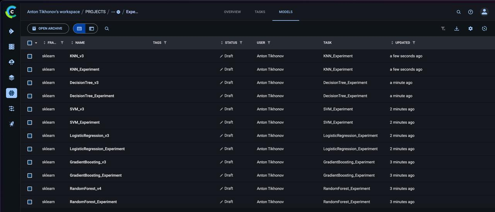

# ClearML интеграция

## Обзор

ClearML используется для:

- 📊 Трекинг экспериментов
- 🤖 Управление моделями
- 🔄 Оркестрация пайплайнов
- 📈 Дашборды и визуализация

### Интерфейс ClearML


*Список экспериментов в ClearML Web UI*

## Настройка

### Облачный ClearML (рекомендуется)

1. Зарегистрируйтесь на [app.clear.ml](https://app.clear.ml)
2. Получите credentials: Settings → Workspace → Create new credentials
3. Настройте клиент:

```bash
clearml-init
```

### Локальный сервер (Docker)

```bash
# Запуск сервера
make clearml_server_start

# Проверка статуса
make clearml_server_status

# Остановка
make clearml_server_stop
```

## Трекинг экспериментов

### Базовое использование

```python
from src.clearml_integration import ClearMLExperiment

with ClearMLExperiment(
    experiment_name="RandomForest_Experiment",
    project_name="EPML-ITMO/Wine-Quality/Experiments",
    tags=["RandomForest", "wine-quality"],
) as exp:
    # Логирование параметров
    exp.log_parameters({"n_estimators": 100})
    
    # Обучение модели
    model.fit(X_train, y_train)
    
    # Логирование метрик
    exp.log_classification_report(y_test, y_pred)
    
    # Логирование модели
    exp.log_model(model, "random_forest")
```

### Декоратор

```python
from src.clearml_integration import clearml_experiment

@clearml_experiment(
    experiment_name="training",
    project_name="EPML-ITMO/Wine-Quality"
)
def train_model(clearml_experiment=None):
    # Код обучения
    clearml_experiment.log_metrics({"accuracy": 0.95})
```

## Управление моделями


*Зарегистрированные модели в ClearML*

```python
from src.clearml_integration import ClearMLModelManager

manager = ClearMLModelManager()

# Регистрация модели
model_id = manager.register_model(
    model=trained_model,
    model_name="RandomForest",
    metrics={"accuracy": 0.95},
    tags=["production"]
)

# Загрузка модели
model, metadata = manager.load_model("RandomForest", version="latest")

# Сравнение моделей
df = manager.compare_models(metric="accuracy")

# Лучшая модель
best_id, best_meta = manager.get_best_model(metric="accuracy")
```

## Пайплайны

```python
from src.clearml_integration import ClearMLPipeline

pipeline = ClearMLPipeline(
    pipeline_name="Wine-Quality-Pipeline",
    version="1.0.0"
)

pipeline.add_data_step(
    train_path="data/processed/train.csv",
    test_path="data/processed/test.csv"
)

pipeline.add_training_step(
    model_name="RandomForest",
    model_params={"n_estimators": 100}
)

pipeline.add_evaluation_step()
pipeline.add_model_registration_step()

results = pipeline.run()
```

## Команды Makefile

| Команда | Описание |
|---------|----------|
| `make clearml_experiments_all` | Запуск всех экспериментов |
| `make clearml_experiments_offline` | Офлайн режим |
| `make clearml_compare_models` | Сравнение моделей |
| `make clearml_pipeline_all` | Все пайплайны |
| `make clearml_dashboard` | Дашборд |
| `make clearml_report` | Генерация отчёта |

## Офлайн режим

Для работы без сервера:

```bash
make clearml_experiments_offline
```

Или программно:

```python
with ClearMLExperiment(
    experiment_name="test",
    offline_mode=True
) as exp:
    # ...
```

Офлайн сессии сохраняются в `~/.clearml/cache/offline/`.

## Сравнение экспериментов

ClearML позволяет визуально сравнивать результаты экспериментов:


*Сравнение метрик моделей в ClearML*

