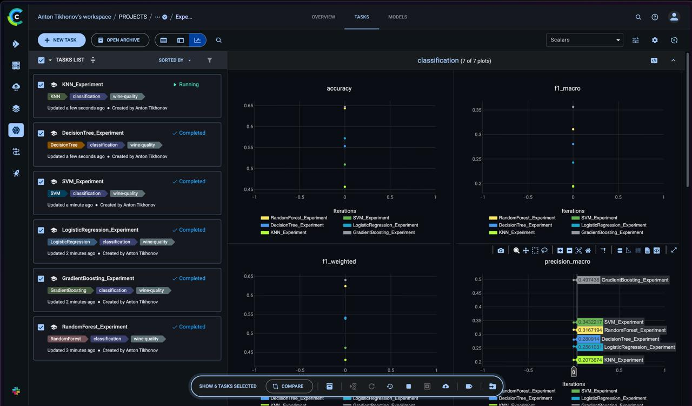
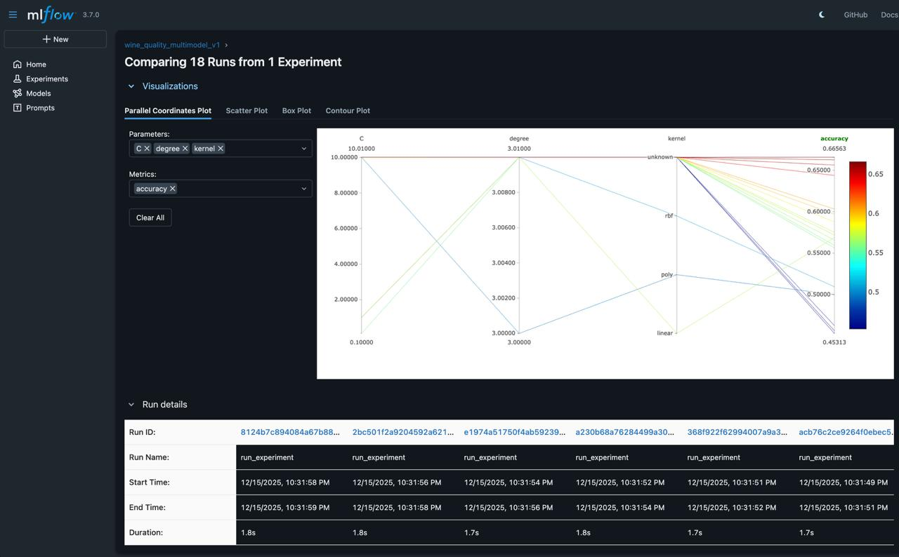
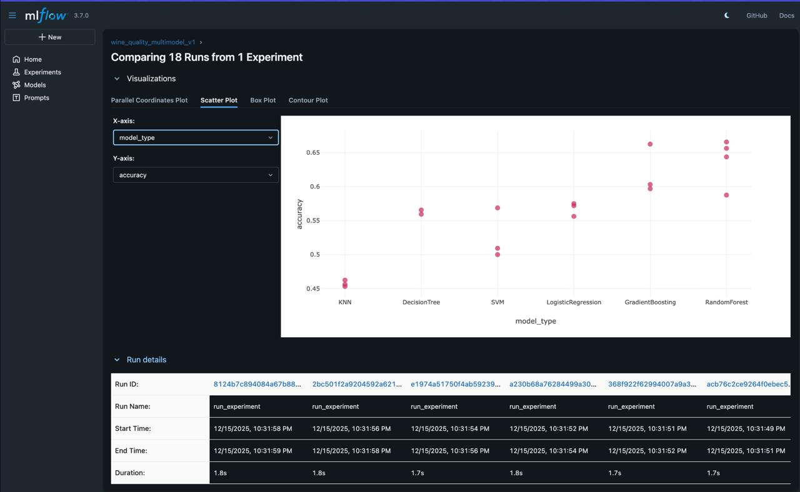

# Результаты экспериментов

## Обзор

Эта страница содержит результаты экспериментов по классификации качества вина.

### ClearML Dashboard


*Сравнение экспериментов в ClearML с визуализацией метрик*

## Метрики моделей

!!! info "Автоматическое обновление"
    Эта таблица генерируется автоматически при запуске 
    `make generate_reports`.

| Модель | Accuracy | Precision | Recall | F1 Score |
|--------|----------|-----------|--------|----------|
| Gradient Boosting | 0.6469 | 0.6606 | 0.6469 | 0.6402 |
| Random Forest | 0.6438 | 0.6108 | 0.6438 | 0.6240 |
| Logistic Regression | 0.5719 | 0.5245 | 0.5719 | 0.5382 |
| Decision Tree | 0.5531 | 0.5320 | 0.5531 | 0.5409 |
| SVM | 0.5094 | 0.5645 | 0.5094 | 0.4618 |
| KNN | 0.4562 | 0.4223 | 0.4562 | 0.4299 |

## Лучшая модель

**Gradient Boosting** показывает лучшие результаты:

- **Accuracy**: 64.69%
- **F1 Score**: 64.02%

### Параметры лучшей модели

```yaml
model: GradientBoosting
params:
  n_estimators: 100
  max_depth: 5
  learning_rate: 0.1
  random_state: 42
```

## Визуализация результатов

### Сравнение Accuracy

```
Gradient Boosting  ████████████████████████████████▌  64.69%
Random Forest      ████████████████████████████████   64.38%
Logistic Regr.     ████████████████████████████▊      57.19%
Decision Tree      ███████████████████████████▋       55.31%
SVM                █████████████████████████▌         50.94%
KNN                ██████████████████████▊            45.62%
```

### Сравнение F1 Score

```
Gradient Boosting  ████████████████████████████████   64.02%
Random Forest      ███████████████████████████████    62.40%
Logistic Regr.     ██████████████████████████▉        53.82%
Decision Tree      ███████████████████████████        54.09%
SVM                ███████████████████████▏           46.18%
KNN                █████████████████████▌             42.99%
```

## Анализ результатов

### Наблюдения

1. **Ансамблевые методы** (Gradient Boosting, Random Forest) показывают лучшие результаты
2. **Линейные модели** (Logistic Regression) работают хуже из-за нелинейности данных
3. **SVM и KNN** требуют нормализации данных для лучших результатов

### Рекомендации

- Для production рекомендуется **Gradient Boosting**
- Для быстрого прототипирования - **Random Forest**
- Необходимо исследовать feature engineering для улучшения результатов

## Воспроизведение результатов

```bash
# Запуск всех экспериментов
make clearml_experiments_offline

# Просмотр результатов
make clearml_compare_models

# Генерация отчётов
make generate_reports
```

## MLflow визуализация

### Parallel Coordinates Plot


*Визуализация параметров и метрик в MLflow*

### Scatter Plot по моделям


*Сравнение accuracy по типам моделей в MLflow*

## Дополнительные отчёты

Подробные отчёты доступны в:

- `outputs/clearml/model_report.md`
- `outputs/clearml/dashboard/dashboard_report.md`
- `outputs/comparison/comparison_report.txt`

